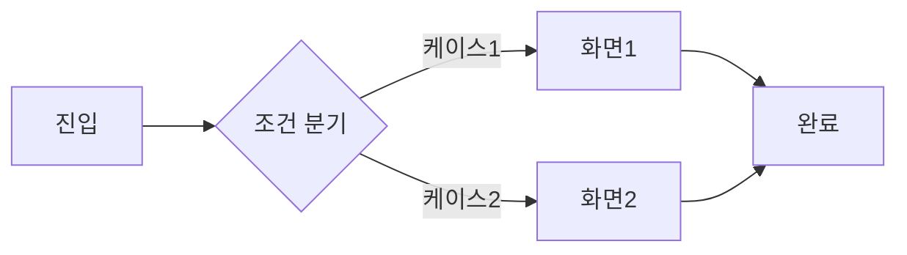

# Episode 2-1. 첫 프로젝트 시작하기: 디자이너의 생존 가이드 🚀 [Enhanced Edition]

## 🎬 Opening: D-Day, 첫 프로젝트 킥오프

### 09:30 AM - 회의실 풍경

"자, 그럼 이번 프로젝트 킥오프를 시작하겠습니다. 신규 온보딩 플로우 개선 프로젝트입니다."

당신은 노트북을 열고 Figma를 켜면서 생각합니다. '드디어 내 첫 프로젝트구나!' 

하지만 30분 후, 당신의 머릿속은...

```
PO: "이번 스프린트 벨로시티는..."
개발자: "API 스펙이 레거시라서..."
QA: "리그레션 테스트 범위가..."
당신: "???" 🤯
```

걱정 마세요. 오늘 이 모든 것을 해독해드리겠습니다.

---

## 📚 Part 1: 프로젝트 시작 전 알아야 할 것들

### 🎯 프로젝트의 진짜 시작은 '왜'부터

#### 킥오프 미팅에서 반드시 물어봐야 할 5가지 질문

1. **"이 프로젝트의 성공을 어떻게 측정하나요?"**
   - ❌ 막연한 답: "사용자 만족도 향상"
   - ✅ 명확한 답: "온보딩 완료율 30% → 50% 상승"

2. **"타겟 사용자는 정확히 누구인가요?"**
   - ❌ 막연한 답: "모든 사용자"
   - ✅ 명확한 답: "20-30대 첫 구매 고객"

3. **"기술적 제약사항이 있나요?"**
   - ❌ 나중에 알게 되는 것: "아, iOS 13 이하도 지원해야 해요"
   - ✅ 미리 확인: "최소 지원 버전, 성능 요구사항 체크"

4. **"데드라인이 움직일 수 있나요?"**
   - ❌ 막연한 기대: "품질이 중요하니까 연장되겠지"
   - ✅ 현실적 확인: "3월 1일 마케팅 캠페인과 연동"

5. **"이전에 시도했다가 실패한 적이 있나요?"**
   - ❌ 모르고 반복: 같은 실수를 또 하기
   - ✅ 교훈 활용: "작년에 시도했던 방식의 문제점 파악"

---

## 🚨 Part 2: 실패 사례로 배우는 첫 프로젝트 함정들

### Case Study 1: "간단한 버튼 추가" 프로젝트의 비극

#### 📅 Day 1: 요청
```
PO: "메인 화면에 '친구 초대' 버튼만 추가하면 돼요. 간단하죠?"
디자이너: "네! 금방 하겠습니다!" (2시간 예상)
```

#### 📅 Day 3: 첫 번째 리뷰
```
개발자: "버튼 클릭하면 어떤 화면으로 가나요?"
디자이너: "아... 그 화면도 디자인해야 하네요?"
```

#### 📅 Day 7: 두 번째 리뷰
```
QA: "친구가 이미 가입했을 때는? 초대 제한이 있나요?"
디자이너: "그런 케이스가 있었나요...?"
```

#### 📅 Day 14: 세 번째 리뷰
```
마케팅: "리워드 정책이 바뀌었어요!"
디자이너: "처음부터 다시...?" 😭
```

#### 🎯 교훈
> "간단한 기능은 없다. 모든 버튼은 플로우고, 모든 플로우는 시스템이다."

#### ✅ 올바른 접근법
```markdown
## 친구 초대 기능 체크리스트
### 화면 설계
- [ ] 진입점 (버튼 위치와 디자인)
- [ ] 초대 방법 선택 화면
- [ ] 공유 화면 (카톡, 링크복사 등)
- [ ] 초대 현황 화면
- [ ] 리워드 안내 화면

### 상태별 디자인
- [ ] 초대 가능 상태
- [ ] 초대 불가 상태 (제한 초과)
- [ ] 이미 가입한 친구
- [ ] 초대 진행 중
- [ ] 초대 완료

### 예외 처리
- [ ] 네트워크 오류
- [ ] 권한 거부 (연락처 접근)
- [ ] 외부 앱 미설치 (카톡 등)
```

---

### Case Study 2: "다크모드 지원" 대참사

#### 🔄 프로젝트 배경
- 기간: 2주 예상 → 실제 6주 소요
- 팀: 디자이너 1명, 개발자 2명
- 결과: 출시 후 롤백

#### 🔴 무엇이 잘못되었나?

**Week 1: 자신만만한 시작**
```
디자이너: "컬러만 반전시키면 되니까 금방이죠!"
*Figma에서 다크 테마 플러그인 실행*
```

**Week 2: 현실의 벽**
```
개발자: "이미지 위의 흰색 텍스트가 안 보여요"
디자이너: "이미지도 다 다시 작업해야 하나요?"
```

**Week 3: 끝없는 예외**
```
- 차트의 색상이 구분 안 됨
- 그림자가 이상하게 보임
- 브랜드 컬러가 다크모드에서 촌스러움
- 아이콘이 배경과 구분 안 됨
```

**Week 4-6: 땜질의 연속**
```
if (다크모드) {
  if (이미지_배경) {
    if (텍스트_있음) {
      // 특수 처리
    }
  }
}
// 코드가 스파게티가 되어감...
```

**출시 후: 유저 피드백 폭발**
```
"다크모드인데 왜 이렇게 밝아요?"
"눈이 아파요"
"차라리 라이트모드가 나아요"
```

#### ✅ 올바른 접근법

**1. 시스템적 접근**
```scss
// 디자인 토큰 정의
--color-background: #FFFFFF;
--color-background-dark: #1A1A1A;
--color-text-primary: #000000;
--color-text-primary-dark: #FFFFFF;

// 시맨틱 컬러 사용
--color-surface
--color-on-surface
--color-primary
--color-on-primary
```

**2. 단계적 적용**
```
Phase 1: 핵심 화면 3개만 먼저
Phase 2: 사용자 피드백 반영
Phase 3: 전체 확산
```

**3. 테스트 매트릭스**
```markdown
| 화면 | 라이트 | 다크 | 자동 전환 | OLED 최적화 |
|-----|-------|------|----------|------------|
| 홈  | ✅ | ✅ | ✅ | ⚠️ |
| 상세 | ✅ | ✅ | ✅ | ❌ |
```

---

### Case Study 3: "모바일 퍼스트" 프로젝트의 아이러니

#### 😅 상황
"모바일 퍼스트로 디자인해주세요!"라고 했지만...

#### 🤦 실제로 일어난 일
1. 모바일만 예쁘게 디자인
2. 태블릿은 모바일 늘리기
3. 데스크톱은 가운데 정렬
4. 결과: 전체 사용자의 60%가 쓰는 데스크톱 경험 최악

#### ✅ 진짜 모바일 퍼스트란?
```
1. 모바일에서 핵심 기능 정의
2. 태블릿에서 보조 기능 추가
3. 데스크톱에서 전체 기능 확장

NOT "모바일만 신경쓰기"
BUT "모바일부터 시작해서 확장하기"
```

---

## 🛠 Part 3: 첫 프로젝트를 위한 실전 템플릿

### 📋 프로젝트 시작 체크리스트

```markdown
# [프로젝트명] 디자인 체크리스트

## 1. 프로젝트 이해도 ✅
- [ ] 비즈니스 목표 명확히 이해
- [ ] 성공 지표(KPI) 확인
- [ ] 타겟 사용자 페르소나 정의
- [ ] 경쟁사/레퍼런스 분석 완료
- [ ] 기술 제약사항 파악

## 2. 디자인 스코프 📐
- [ ] 디자인할 화면 목록 작성
- [ ] 각 화면의 상태 정의 (기본/로딩/에러/빈화면)
- [ ] 반응형 브레이크포인트 결정
- [ ] 다크모드 지원 여부 확인
- [ ] 접근성 요구사항 체크

## 3. 협업 준비 🤝
- [ ] 개발자와 기술 검토 미팅
- [ ] QA와 테스트 시나리오 논의
- [ ] PM과 일정 조율
- [ ] 디자인 핸드오프 방식 합의

## 4. 디자인 시스템 🎨
- [ ] 기존 컴포넌트 활용 가능 여부
- [ ] 신규 컴포넌트 정의 필요성
- [ ] 컬러/타이포그래피 가이드 확인
- [ ] 아이콘/일러스트 스타일 결정

## 5. 리스크 관리 ⚠️
- [ ] 크리티컬 패스 파악
- [ ] 플랜 B 준비
- [ ] 단계별 출시 가능성 검토
```

### 📊 디자인 스펙 문서 템플릿

```markdown
# [기능명] 디자인 스펙

## 개요
- **목적**: 사용자가 [무엇]을 할 수 있도록
- **예상 사용자**: [구체적인 타겟]
- **성공 지표**: [측정 가능한 목표]

## 사용자 플로우


## 화면별 상세
### 화면 1: [화면명]
- **Figma 링크**: [URL]
- **주요 기능**: 
  - 기능 1
  - 기능 2
- **인터랙션**:
  - 클릭: [동작]
  - 스와이프: [동작]
- **엣지 케이스**:
  - 데이터 없을 때
  - 로딩 중
  - 에러 발생

## 개발 고려사항
- [ ] API 호출 시점
- [ ] 캐싱 정책
- [ ] 애니메이션 성능
- [ ] 접근성 (스크린리더 등)

## QA 시나리오
1. 정상 플로우
2. 엣지 케이스
3. 오류 상황
4. 성능 테스트
```

### 💬 커뮤니케이션 템플릿

#### 기술 검토 요청
```
안녕하세요! 🙋‍♀️

[기능명] 디자인 초안이 나왔습니다.
기술 검토 부탁드려요!

주요 확인사항:
1. [인터랙션/애니메이션]: 구현 가능한가요?
2. [데이터 표시]: API에서 제공 가능한가요?
3. [성능]: 부담되는 부분이 있나요?

Figma: [링크]
예상 개발 기간이 궁금합니다!
```

#### 디자인 변경 공유
```
변경사항 공유드립니다 🔔

변경 내용:
- AS-IS: [이전 디자인]
- TO-BE: [새 디자인]

변경 이유:
[사용자 피드백/데이터 기반 근거]

영향 범위:
- 개발: [예상 수정 범위]
- QA: [재테스트 필요 영역]

급한 정도: 🔥🔥🔥 (긴급/보통/여유)
```

---

## 💡 Part 4: 첫 프로젝트 성공 전략

### 🎯 Week 1: 이해와 계획
```
월: 킥오프 & 요구사항 파악
화: 레퍼런스 리서치
수: 정보 구조(IA) 설계
목: 와이어프레임 스케치
금: 팀 리뷰 & 피드백
```

### 🎨 Week 2: 디자인 스프린트
```
월: 주요 화면 디자인
화: 상태별 디자인 (loading, error, empty)
수: 개발자 리뷰 (기술 검토)
목: 피드백 반영
금: 디자인 QA & 핸드오프 준비
```

### 🚀 Week 3: 개발과 함께
```
월: 개발 착수 & 디자인 QA
화-목: 실시간 이슈 대응
금: 다음 스프린트 준비
```

### 📈 성공 측정하기

#### 정량적 지표
- 디자인 → 개발 핸드오프 시간
- 디자인 수정 요청 횟수
- QA 이슈 중 디자인 관련 비율

#### 정성적 피드백
- 개발팀 만족도
- 사용자 피드백
- 프로젝트 회고 내용

---

## 🎓 Part 5: 선배들의 조언

### 3년차 디자이너 A
> "첫 프로젝트에서 완벽하려고 하지 마세요. 
> 70% 완성도로 빠르게 피드백 받고 개선하는 게 
> 100% 완성도를 목표로 하다가 시간 초과하는 것보다 낫습니다."

### 5년차 디자이너 B
> "개발자가 '안 된다'고 하면 '왜 안 되는지' 물어보세요.
> 대부분 다른 방법이 있습니다. 
> 함께 해결책을 찾는 과정이 진짜 협업입니다."

### 10년차 디자이너 C
> "디자인은 문제 해결이지 예술 작품이 아닙니다.
> 비즈니스 목표와 사용자 needs의 교집합을 찾으세요.
> 그리고 그것을 아름답게 만드세요."

---

## 🚦 Part 6: 위험 신호와 대처법

### 🔴 Red Flags (즉시 대응 필요)

1. **"일단 만들고 나중에 수정하죠"**
   - 위험: 기술 부채 누적
   - 대응: 최소 스펙이라도 명확히 정의

2. **"다른 앱 똑같이 만들어주세요"**
   - 위험: 저작권 이슈, 컨텍스트 무시
   - 대응: 레퍼런스의 '원리'를 차용

3. **"개발자가 알아서 하겠죠"**
   - 위험: 의도와 다른 구현
   - 대응: 명확한 스펙과 충분한 커뮤니케이션

### 🟡 Yellow Flags (주의 필요)

1. **스펙 문서 없이 진행**
   - 각자 다른 그림을 그리게 됨

2. **QA 없이 바로 배포**
   - 사용자가 버그를 발견하게 됨

3. **회고 없이 다음 프로젝트**
   - 같은 실수 반복

---

## 📱 Part 7: 실전 시나리오 연습

### Scenario 1: 긴급 수정 요청
```
상황: 출시 3일 전, PO가 메인 화면 레이아웃 변경 요청

당신의 선택:
A) "안 됩니다. 이미 개발 완료했어요."
B) "일단 출시하고 다음 버전에서 개선하면 어떨까요?"
C) "어떤 문제를 해결하려는 건지 먼저 이야기해볼까요?"

정답: C
→ 문제의 본질을 파악하면 최소 수정으로 해결 가능한 경우가 많음
```

### Scenario 2: 개발자와 의견 충돌
```
상황: 당신은 fade 애니메이션, 개발자는 slide 추천

당신의 선택:
A) "디자인은 제 영역이에요"
B) "그럼 개발자님 마음대로 하세요"
C) "각각의 장단점을 비교해보고 결정하죠"

정답: C
→ 프로토타입으로 비교하거나 A/B 테스트 제안
```

---

## 🎁 보너스: 첫 프로젝트 생존 키트

### 필수 준비물
- [ ] 디자인 시스템 (또는 스타일 가이드)
- [ ] 컴포넌트 라이브러리
- [ ] 디바이스별 프리뷰 도구
- [ ] 버전 관리 시스템 (Figma 히스토리)
- [ ] 커뮤니케이션 채널 (Slack, Jira)

### 추천 학습 자료
- 개발 기초: "개발자도 디자이너도 알아야 할 것들"
- 프로세스: "애자일/스크럼 실무 가이드"
- 협업: "디자이너와 개발자가 함께 일하는 법"

### 자주 쓰는 개발 용어 사전
- **MVP**: 최소 기능 제품
- **스프린트**: 1-2주 단위 개발 주기
- **백로그**: 할 일 목록
- **스탠드업**: 일일 진행상황 공유
- **레트로**: 회고 미팅

---

## 💎 오늘의 핵심 메시지

> "첫 프로젝트는 완벽하지 않아도 됩니다.
> 하지만 배움은 완벽해야 합니다.
> 실패해도 괜찮아요. 같은 실패만 반복하지 않으면 됩니다."

**기억하세요:**
1. 🎯 명확한 목표 설정
2. 🤝 적극적인 커뮤니케이션
3. 📝 꼼꼼한 문서화
4. 🔄 빠른 피드백 루프
5. 📚 지속적인 학습

---

## 🔜 다음 에피소드 예고

**"개발자와의 첫 협업: 디자인 핸드오프의 모든 것"**
- Figma에서 개발자 모드 200% 활용법
- 디자인 스펙 작성의 정석
- 개발자가 사랑하는 디자이너 되기

첫 프로젝트, 화이팅! 🚀

---

*🎬 hanib_tech와 함께하는 디자이너의 IT 생존기*  
*실패해도 괜찮아, 배우면 되니까!*

#첫프로젝트 #디자이너생존기 #개발협업 #hanib_tech