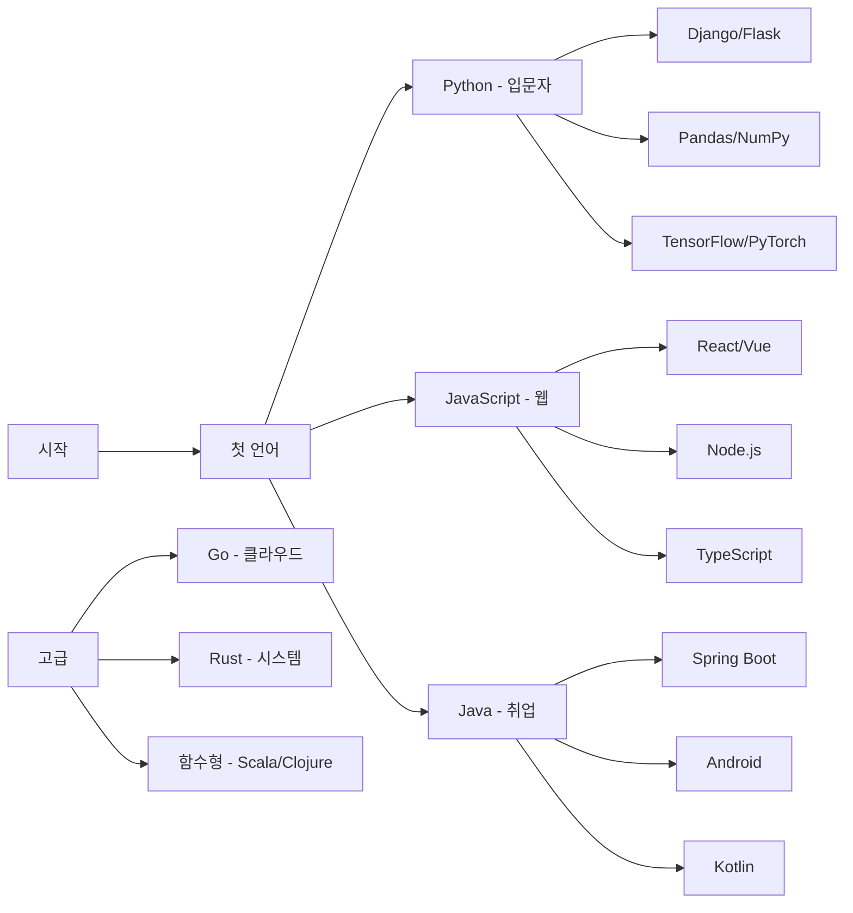

# Episode 7-1: 프로그래밍 언어 선택, 첫 단추를 제대로 끼우기

## 🎬 Scene: 언어 선택의 딜레마

```
코딩 부트캠프 첫날

강사: "어떤 언어를 배우고 싶으신가요?"

수강생 A: "취업 잘 되는 걸로요!"
수강생 B: "연봉 높은 걸로요!"
수강생 C: "쉬운 걸로요!"
디자이너: "디자인 툴이랑 연동되는 걸로요!"

[6개월 후]

수강생 A: Java 배움 → 대기업 SI 취업
수강생 B: Go 배움 → 스타트업 입사
수강생 C: Python 배움 → 데이터 분석가
디자이너: JavaScript 배움 → 프론트엔드 개발

모두의 결론:
"첫 언어는 중요하지만, 결국 여러 개 배우게 돼요"
```

**프로그래밍 언어는 도구입니다. 목적에 맞는 도구를 선택하세요.**

## Part 1: 언어 생태계 이해하기

### 🗺 프로그래밍 언어 지형도

```
언어 카테고리:

1. 시스템 프로그래밍
C/C++ → Rust
- OS, 임베디드
- 게임 엔진
- 고성능 요구

2. 엔터프라이즈
Java → Kotlin
C# → F#
- 대규모 시스템
- 금융, 제조
- 안정성 중시

3. 웹 개발
JavaScript/TypeScript
PHP → Laravel
Ruby → Rails
- 웹 애플리케이션
- 빠른 개발
- 생태계 풍부

4. 데이터/AI
Python → Julia
R → Python
- 데이터 분석
- 머신러닝
- 과학 계산

5. 모바일
Swift (iOS)
Kotlin (Android)
Dart (Flutter)
- 네이티브 앱
- 크로스 플랫폼

6. 신흥 언어
Go (클라우드)
Rust (시스템)
Zig (C 대체)
- 특정 문제 해결
- 현대적 설계
```

### 📊 2024년 언어 트렌드

```python
# Stack Overflow 2024 Survey 기준

popularity = {
    'JavaScript': 65.82,
    'Python': 48.24,
    'TypeScript': 38.87,
    'Java': 30.55,
    'C#': 27.62,
    'C++': 22.42,
    'Go': 13.24,
    'Rust': 12.21,
    'Swift': 9.15
}

salary = {  # 연봉 중앙값 (글로벌)
    'Rust': 87000,
    'Go': 85000,
    'Scala': 83000,
    'Ruby': 80000,
    'Python': 75000,
    'TypeScript': 73000,
    'Java': 72000,
    'JavaScript': 65000,
    'PHP': 55000
}

satisfaction = {  # 개발자 만족도
    'Rust': 87,
    'TypeScript': 73,
    'Python': 72,
    'Go': 70,
    'Kotlin': 68,
    'Swift': 67,
    'JavaScript': 58,
    'Java': 53,
    'PHP': 41
}

growth_rate = {  # YoY 성장률
    'Rust': '+35%',
    'TypeScript': '+28%',
    'Go': '+22%',
    'Kotlin': '+18%',
    'Python': '+15%',
    'Swift': '+10%',
    'JavaScript': '+5%',
    'Java': '-2%',
    'PHP': '-8%'
}
```

## Part 2: 주요 언어 상세 가이드

### 🐍 Python - 만능 스위스 나이프

```python
# Python 특징과 활용

# 장점
strengths = {
    '쉬운 문법': '영어와 유사',
    '빠른 프로토타이핑': '아이디어 → 구현',
    '풍부한 라이브러리': 'pip install anything',
    '다양한 활용': '웹, 데이터, AI, 자동화',
    '커뮤니티': '거대하고 친절'
}

# 단점
weaknesses = {
    '속도': 'C보다 100배 느림',
    'GIL': '멀티스레딩 제한',
    '모바일': '지원 약함',
    '타입': '런타임 에러'
}

# 실제 사용 예시
# 1. 웹 개발 (Django/FastAPI)
from fastapi import FastAPI
app = FastAPI()

@app.get("/")
async def root():
    return {"message": "Hello World"}

# 2. 데이터 분석
import pandas as pd
import matplotlib.pyplot as plt

df = pd.read_csv('sales.csv')
df.groupby('category')['revenue'].sum().plot(kind='bar')

# 3. 머신러닝
from sklearn.ensemble import RandomForestClassifier
model = RandomForestClassifier()
model.fit(X_train, y_train)

# 4. 자동화
import schedule

def backup():
    print("Backing up...")

schedule.every().day.at("02:00").do(backup)

# 적합한 사람
ideal_for = [
    '프로그래밍 입문자',
    '데이터 사이언티스트',
    'AI 엔지니어',
    '백엔드 개발자',
    '디자이너 (자동화)'
]
```

### 🌐 JavaScript/TypeScript - 웹의 왕

```javascript
// JavaScript/TypeScript 생태계

// 프론트엔드
const frontend = {
  vanilla: 'Pure JavaScript',
  react: 'Facebook',
  vue: 'Progressive',
  angular: 'Enterprise',
  svelte: 'Compile-time'
};

// 백엔드 (Node.js)
const backend = {
  express: 'Minimal',
  nest: 'Enterprise',
  fastify: 'Performance',
  next: 'Full-stack'
};

// TypeScript 장점
interface User {
  id: number;
  name: string;
  email: string;
}

function getUser(id: number): Promise<User> {
  // 타입 안정성
  return fetch(`/api/users/${id}`)
    .then(res => res.json());
}

// 실제 활용
// 1. React 컴포넌트
const Button: React.FC<{onClick: () => void}> = ({onClick, children}) => {
  return <button onClick={onClick}>{children}</button>
};

// 2. Node.js API
app.get('/api/users/:id', async (req, res) => {
  const user = await db.users.findById(req.params.id);
  res.json(user);
});

// 3. 풀스택 (Next.js)
export default function HomePage({data}) {
  return <div>{data.map(item => <Card key={item.id} {...item} />)}</div>
}

export async function getServerSideProps() {
  const data = await fetch('https://api.example.com/data');
  return {props: {data}};
}

// 적합한 사람
const idealFor = [
  '웹 개발자',
  '풀스택 지망생',
  'UI/UX 디자이너',
  '프론트엔드 특화',
  '스타트업 개발자'
];
```

### ☕ Java - 엔터프라이즈의 표준

```java
// Java의 세계

public class JavaEcosystem {
    // 장점
    private final List<String> strengths = Arrays.asList(
        "플랫폼 독립성 (JVM)",
        "성숙한 생태계",
        "엔터프라이즈 표준",
        "강력한 타입 시스템",
        "뛰어난 성능"
    );
    
    // 프레임워크
    enum Frameworks {
        SPRING("웹 애플리케이션"),
        SPRING_BOOT("마이크로서비스"),
        HIBERNATE("ORM"),
        APACHE_KAFKA("메시징"),
        ELASTICSEARCH("검색엔진");
        
        private final String usage;
        Frameworks(String usage) {
            this.usage = usage;
        }
    }
    
    // Spring Boot 예시
    @RestController
    @RequestMapping("/api/users")
    public class UserController {
        @Autowired
        private UserService userService;
        
        @GetMapping("/{id}")
        public ResponseEntity<User> getUser(@PathVariable Long id) {
            return ResponseEntity.ok(userService.findById(id));
        }
        
        @PostMapping
        public ResponseEntity<User> createUser(@Valid @RequestBody UserDto dto) {
            User user = userService.create(dto);
            return ResponseEntity.created(URI.create("/api/users/" + user.getId()))
                    .body(user);
        }
    }
    
    // 적합한 분야
    public static List<String> idealFor() {
        return List.of(
            "대기업 SI",
            "금융 시스템",
            "안드로이드 개발",
            "백엔드 서버",
            "대규모 시스템"
        );
    }
}
```

### 🦀 Rust - 안전한 시스템 프로그래밍

```rust
// Rust - 메모리 안전성과 성능

// 소유권 시스템
fn ownership_example() {
    let s1 = String::from("hello");
    let s2 = s1;  // s1은 더 이상 유효하지 않음
    // println!("{}", s1);  // 컴파일 에러!
    println!("{}", s2);  // OK
}

// 패턴 매칭
enum Message {
    Quit,
    Move { x: i32, y: i32 },
    Write(String),
    ChangeColor(i32, i32, i32),
}

fn process_message(msg: Message) {
    match msg {
        Message::Quit => println!("Quit"),
        Message::Move { x, y } => println!("Move to ({}, {})", x, y),
        Message::Write(text) => println!("Text: {}", text),
        Message::ChangeColor(r, g, b) => println!("RGB: ({}, {}, {})", r, g, b),
    }
}

// 웹 서버 (Actix)
use actix_web::{web, App, HttpServer, Result};
use serde::{Deserialize, Serialize};

#[derive(Serialize, Deserialize)]
struct User {
    id: u32,
    name: String,
}

async fn get_user(path: web::Path<u32>) -> Result<web::Json<User>> {
    let user = User {
        id: path.into_inner(),
        name: String::from("Alice"),
    };
    Ok(web::Json(user))
}

#[actix_web::main]
async fn main() -> std::io::Result<()> {
    HttpServer::new(|| {
        App::new()
            .route("/users/{id}", web::get().to(get_user))
    })
    .bind("127.0.0.1:8080")?
    .run()
    .await
}

// 적합한 분야
const IDEAL_FOR: &[&str] = &[
    "시스템 프로그래밍",
    "WebAssembly",
    "블록체인",
    "게임 엔진",
    "고성능 서버"
];
```

## Part 3: 언어 선택 가이드

### 🎯 목적별 추천

```yaml
웹 프론트엔드:
  필수: JavaScript/TypeScript
  프레임워크: React, Vue, Angular
  스타일링: CSS, Tailwind
  
웹 백엔드:
  성능중시: Go, Rust
  생산성: Python (Django), Ruby (Rails)
  엔터프라이즈: Java (Spring), C# (.NET)
  풀스택: JavaScript (Node.js)

모바일:
  iOS: Swift
  Android: Kotlin
  크로스플랫폼: Flutter (Dart), React Native (JS)

데이터/AI:
  분석: Python, R
  빅데이터: Scala (Spark), Java
  머신러닝: Python (TensorFlow, PyTorch)
  
게임개발:
  엔진: C++ (Unreal), C# (Unity)
  인디: Godot (GDScript), Love2D (Lua)
  
시스템/임베디드:
  전통적: C, C++
  현대적: Rust, Zig
  
DevOps/클라우드:
  인프라: Go, Python
  스크립팅: Bash, Python
  IaC: HCL (Terraform)
```

### 🎓 학습 로드맵



## Part 4: 실전 프로젝트

### 💻 언어별 첫 프로젝트

```python
# Python - Todo API
from flask import Flask, jsonify, request

app = Flask(__name__)
todos = []

@app.route('/todos', methods=['GET', 'POST'])
def handle_todos():
    if request.method == 'POST':
        todo = request.json
        todos.append(todo)
        return jsonify(todo), 201
    return jsonify(todos)

# JavaScript - Interactive Web
const todoApp = {
  todos: [],
  
  add(text) {
    this.todos.push({
      id: Date.now(),
      text,
      done: false
    });
    this.render();
  },
  
  toggle(id) {
    const todo = this.todos.find(t => t.id === id);
    if (todo) todo.done = !todo.done;
    this.render();
  },
  
  render() {
    const html = this.todos.map(todo => `
      <li class="${todo.done ? 'done' : ''}">
        ${todo.text}
      </li>
    `).join('');
    document.getElementById('todos').innerHTML = html;
  }
};

// Java - REST API
@RestController
@RequestMapping("/api/todos")
public class TodoController {
    private List<Todo> todos = new ArrayList<>();
    
    @GetMapping
    public List<Todo> getTodos() {
        return todos;
    }
    
    @PostMapping
    public Todo createTodo(@RequestBody Todo todo) {
        todos.add(todo);
        return todo;
    }
}

// Go - Concurrent Web Scraper
package main

import (
    "fmt"
    "sync"
)

func scrape(url string, wg *sync.WaitGroup) {
    defer wg.Done()
    // Scraping logic
    fmt.Printf("Scraped: %s\n", url)
}

func main() {
    urls := []string{"url1", "url2", "url3"}
    var wg sync.WaitGroup
    
    for _, url := range urls {
        wg.Add(1)
        go scrape(url, &wg)
    }
    
    wg.Wait()
}
```

## Part 5: 폴리글랏 프로그래밍

### 🌍 여러 언어 마스터하기

```
언어 학습 전략:

1단계: 핵심 언어 (1-2년)
- 하나를 깊게
- 기본기 탄탄히
- 실제 프로젝트

2단계: 보조 언어 (6개월)
- 다른 패러다임
- 특정 도메인
- 비교 학습

3단계: 폴리글랏 (계속)
- 필요시 학습
- 개념 중심
- 빠른 적응

언어 조합 예시:

풀스택 개발자:
- Main: TypeScript
- Backend: Python/Go
- Database: SQL
- Scripting: Bash

데이터 사이언티스트:
- Main: Python
- Stats: R
- Big Data: Scala
- Database: SQL

시스템 엔지니어:
- Main: Go/Rust
- Scripting: Python
- Legacy: C/C++
- Cloud: HCL

전환 가이드:
Python → JavaScript: 1개월
Java → Kotlin: 2주
JavaScript → TypeScript: 1주
C++ → Rust: 2개월
Any → Go: 3주
```

## 🎁 Bonus: 미래를 위한 준비

### 🔮 차세대 언어들

```
주목할 언어:

1. Carbon (Google)
- C++ 후계자
- 2024년 0.1 릴리즈
- 상호운용성 중점

2. Mojo
- Python 슈퍼셋
- AI 특화
- 35,000x 빠름

3. Zig
- C 대체
- 컴파일타임 실행
- 메모리 안전

4. Nim
- Python + 성능
- 메타프로그래밍
- 다중 백엔드

AI 시대 준비:
- Prompt Engineering
- AI 도구 활용
- 코드 리뷰 능력
- 아키텍처 설계
```

## 💡 핵심 메시지

> "최고의 언어는 없습니다.
> 최적의 언어만 있을 뿐입니다.
> 
> 첫 언어로 프로그래밍의 개념을 배우고,
> 두 번째 언어로 시야를 넓히고,
> 세 번째 언어로 전문가가 됩니다.
> 
> 언어는 도구일 뿐,
> 문제 해결 능력이 본질입니다."

**기억하세요:**
- 개념 > 문법
- 깊이 > 개수
- 실전 > 이론
- 꾸준함 > 속도

## 🚀 다음 에피소드 예고

**"Episode 7-2: 객체지향 vs 함수형"**

프로그래밍 패러다임:
- OOP의 원칙
- 함수형의 순수함
- 혼합 패러다임
- 실전 적용

"클래스가 먼저냐, 함수가 먼저냐"

---

*"The limits of my language mean the limits of my world."
- Ludwig Wittgenstein*

**#프로그래밍언어 #Python #JavaScript #Java #Rust #개발자**