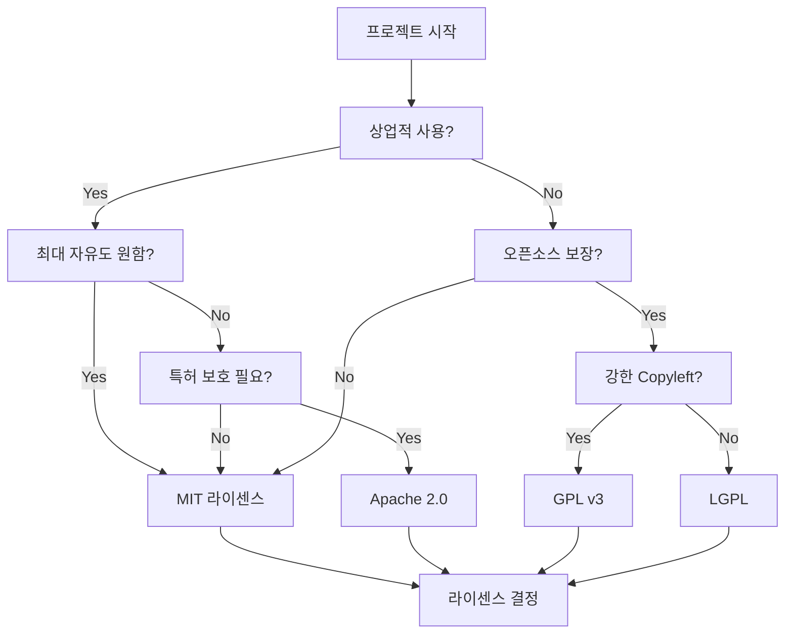

# Episode 7-9: MIT 라이센스가 개발자에게 최고인 이유

## 🎬 Scene: 라이센스 지옥

```
[스타트업 법무 검토, 금요일 오후]

개발자: "이 라이브러리 써도 되나요?"

법무팀: "라이센스가 뭔가요?"

개발자: "GPL v3인데요."

법무팀: "절대 안 됩니다! 우리 코드도 공개해야 해요!"

개발자: "그럼 이건요? Apache 2.0?"

법무팀: "특허 조항 검토해야 해요. 일주일 주세요."

개발자: "MIT 라이센스는요?"

법무팀: "아, MIT요? 바로 쓰세요."

디자이너: "왜 MIT만 바로 OK예요?"

법무팀: "MIT는 '마음대로 쓰되 내 탓하지 마' 라이센스거든요."

[1개월 후]

CEO: "왜 우리 제품 출시가 늦어졌죠?"

CTO: "GPL 라이브러리 하나 때문에 코드 다시 짰어요..."

CEO: "앞으로 MIT만 쓰세요!"

[현재 GitHub 통계]
MIT 라이센스: 45% (1위)
Apache: 13%
GPL: 9%

교훈: 단순함이 최고다
```

**MIT: 개발자가 사랑하고 변호사가 안심하는 라이센스**

## Part 1: MIT 라이센스 완전 해부

### 📜 MIT 라이센스 전문 (단 21줄!)

```text
MIT License

Copyright (c) [year] [fullname]

Permission is hereby granted, free of charge, to any person obtaining a copy
of this software and associated documentation files (the "Software"), to deal
in the Software without restriction, including without limitation the rights
to use, copy, modify, merge, publish, distribute, sublicense, and/or sell
copies of the Software, and to permit persons to whom the Software is
furnished to do so, subject to the following conditions:

The above copyright notice and this permission notice shall be included in all
copies or substantial portions of the Software.

THE SOFTWARE IS PROVIDED "AS IS", WITHOUT WARRANTY OF ANY KIND, EXPRESS OR
IMPLIED, INCLUDING BUT NOT LIMITED TO THE WARRANTIES OF MERCHANTABILITY,
FITNESS FOR A PARTICULAR PURPOSE AND NONINFRINGEMENT. IN NO EVENT SHALL THE
AUTHORS OR COPYRIGHT HOLDERS BE LIABLE FOR ANY CLAIM, DAMAGES OR OTHER
LIABILITY, WHETHER IN AN ACTION OF CONTRACT, TORT OR OTHERWISE, ARISING FROM,
OUT OF OR IN CONNECTION WITH THE SOFTWARE OR THE USE OR OTHER DEALINGS IN THE
SOFTWARE.
```

### 🔍 조항별 상세 분석

```javascript
// MIT 라이센스 조항 분석

const mitLicense = {
  // 1. 권한 부여 (Grant)
  permissions: {
    use: "✅ 사용 - 어떤 목적으로든",
    copy: "✅ 복사 - 무제한",
    modify: "✅ 수정 - 마음대로",
    merge: "✅ 병합 - 다른 코드와",
    publish: "✅ 공개 - 어디든",
    distribute: "✅ 배포 - 무료/유료",
    sublicense: "✅ 재라이센스 - 다른 조건으로",
    sell: "✅ 판매 - 상업적 이용"
  },
  
  // 2. 조건 (Conditions) - 단 하나!
  conditions: {
    include_license: "원본 라이센스와 저작권 표시 포함"
  },
  
  // 3. 제한사항 (Limitations)
  limitations: {
    no_liability: "책임 없음 - 문제 생겨도 원작자 책임 X",
    no_warranty: "보증 없음 - 작동 보장 X"
  }
};

// 실제 사용 예시
function useMITLibrary() {
  // ✅ 가능한 것들
  const allowed = {
    "스타트업_제품": "MIT 라이브러리로 SaaS 만들어 판매",
    "대기업_사용": "내부 시스템에 포함",
    "수정_배포": "코드 수정해서 새 라이브러리 만들기",
    "비공개": "수정한 코드 공개 안 해도 됨",
    "재라이센스": "내 제품은 다른 라이센스 적용"
  };
  
  // ❌ 하면 안 되는 것
  const prohibited = {
    "라이센스_삭제": "MIT 라이센스 텍스트 제거",
    "저작권_삭제": "원작자 이름 삭제",
    "책임_전가": "버그로 손해 봤다고 원작자 고소"
  };
  
  return { allowed, prohibited };
}
```

## Part 2: 다른 라이센스와 비교

### ⚖️ 주요 오픈소스 라이센스 비교

```python
# 라이센스 비교 매트릭스

licenses_comparison = {
    "MIT": {
        "자유도": "⭐⭐⭐⭐⭐",
        "의무사항": ["저작권 표시"],
        "상업이용": "✅",
        "수정후_비공개": "✅",
        "특허보호": "❌",
        "법적복잡도": "매우 낮음",
        "기업선호도": "95%",
        "인기도": "#1 (45%)"
    },
    
    "Apache 2.0": {
        "자유도": "⭐⭐⭐⭐",
        "의무사항": [
            "저작권 표시",
            "변경사항 명시",
            "NOTICE 파일 포함"
        ],
        "상업이용": "✅",
        "수정후_비공개": "✅",
        "특허보호": "✅ 명시적 특허 허가",
        "법적복잡도": "중간",
        "기업선호도": "80%",
        "인기도": "#2 (13%)"
    },
    
    "GPL v3": {
        "자유도": "⭐⭐",
        "의무사항": [
            "저작권 표시",
            "소스코드 공개",
            "동일 라이센스 유지",
            "설치 정보 제공"
        ],
        "상업이용": "✅ (단, 코드 공개)",
        "수정후_비공개": "❌",
        "특허보호": "✅",
        "법적복잡도": "높음",
        "기업선호도": "20%",
        "인기도": "#3 (9%)"
    },
    
    "BSD": {
        "자유도": "⭐⭐⭐⭐⭐",
        "의무사항": ["저작권 표시"],
        "상업이용": "✅",
        "수정후_비공개": "✅",
        "특허보호": "❌",
        "법적복잡도": "매우 낮음",
        "기업선호도": "90%",
        "인기도": "#4 (6%)"
    }
}

def choose_license(project_type):
    """프로젝트별 최적 라이센스"""
    
    if project_type == "상업_제품":
        return "MIT or Apache 2.0"
    
    elif project_type == "오픈소스_보장":
        return "GPL v3"
    
    elif project_type == "기업_라이브러리":
        return "Apache 2.0 (특허 보호)"
    
    elif project_type == "최대_자유도":
        return "MIT or BSD"
    
    elif project_type == "듀얼_라이센스":
        return "GPL (유료 라이센스 강제)"
```

### 🔄 라이센스 호환성

```javascript
// 라이센스 호환성 체크

const licenseCompatibility = {
  MIT: {
    호환가능: ["모든 라이센스"],
    이유: "제약이 거의 없음",
    
    예시: {
      "MIT + GPL": "✅ GPL로 배포 가능",
      "MIT + Apache": "✅ Apache로 배포 가능",
      "MIT + 상용": "✅ 상용 제품 포함 가능"
    }
  },
  
  GPL: {
    호환가능: ["GPL 계열만"],
    이유: "전염성(Copyleft)",
    
    예시: {
      "GPL + MIT": "⚠️ 전체가 GPL 됨",
      "GPL + Apache": "❌ 호환 불가 (v2)",
      "GPL + 상용": "❌ 코드 공개 필요"
    }
  },
  
  Apache: {
    호환가능: ["MIT", "BSD", "Apache"],
    이유: "특허 조항",
    
    예시: {
      "Apache + MIT": "✅ 가능",
      "Apache + GPL3": "✅ 가능 (v3만)",
      "Apache + GPL2": "❌ 불가능"
    }
  }
};

// 실제 프로젝트 라이센스 조합 예시
const projectExample = {
  "React 앱": {
    React: "MIT",
    Redux: "MIT",  
    "Material-UI": "MIT",
    결과: "✅ 상용 제품 가능"
  },
  
  "Linux 커널 모듈": {
    "Linux Kernel": "GPL v2",
    "Custom Module": "GPL v2 강제",
    결과: "❌ 소스 공개 필수"
  },
  
  "Android 앱": {
    "Android SDK": "Apache 2.0",
    "앱 코드": "자유 선택",
    결과: "✅ 비공개 가능"
  }
};
```

## Part 3: MIT 성공 사례

### 🌟 MIT 라이센스 대표 프로젝트

```javascript
// MIT 라이센스로 세상을 바꾼 프로젝트들

const mitSuccessStories = {
  // 1. jQuery (2006)
  jQuery: {
    영향: "웹 개발 혁명",
    사용률: "한때 웹사이트 70%",
    
    성공이유: {
      "MIT선택": "기업들이 안심하고 채택",
      "단순함": "$ 하나로 DOM 조작",
      "생태계": "수만 개 플러그인"
    },
    
    비즈니스: {
      jQuery_Foundation: "비영리 재단",
      수익: "기부 + 컨퍼런스",
      가치: "웹 표준 발전"
    }
  },
  
  // 2. Ruby on Rails (2004)
  Rails: {
    영향: "웹 프레임워크 패러다임",
    회사들: "GitHub, Shopify, Airbnb",
    
    MIT선택이유: {
      DHH: "최대한 많은 사람이 쓰길 원했다",
      결과: "스타트업 표준 스택"
    },
    
    경제효과: {
      창출가치: "$1조+ 기업 가치",
      일자리: "수십만 Rails 개발자"
    }
  },
  
  // 3. React (2013)
  React: {
    변천사: {
      2013: "BSD + Patents (논란)",
      2017: "MIT 전환 (커뮤니티 압력)",
      결과: "폭발적 성장"
    },
    
    MIT전환_효과: {
      Before: "대기업 채택 거부",
      After: "업계 표준 (40%+ 점유율)",
      
      채택기업: [
        "Netflix", "Uber", "Airbnb",
        "Facebook", "Instagram", "WhatsApp"
      ]
    }
  },
  
  // 4. VS Code (2015)
  VSCode: {
    Microsoft전략: {
      오픈소스: "MIT 라이센스",
      목적: "개발자 생태계 장악",
      결과: "IDE 시장 1위 (70%+)"
    },
    
    수익모델: {
      직접: "$0",
      간접: {
        Azure: "클라우드 연동",
        GitHub: "Copilot 구독",
        생태계: "MS 기술 스택 확산"
      }
    }
  }
};

// MIT가 가져온 경제 효과
const economicImpact = {
  직접가치: {
    상용제품: "수조 달러 규모",
    스타트업: "수만 개 회사",
    일자리: "수백만 개발자"
  },
  
  간접가치: {
    혁신가속: "10배 빠른 개발",
    진입장벽: "극적 감소",
    교육: "무료 학습 자료"
  }
};
```

## Part 4: 실무 가이드

### 📋 MIT 라이센스 체크리스트

```python
# 개발자/디자이너를 위한 MIT 체크리스트

class MITLicenseGuide:
    def __init__(self):
        self.role = None
    
    def for_developers(self):
        """개발자가 확인할 사항"""
        return {
            "사용_전": [
                "✅ LICENSE 파일 확인",
                "✅ 저작권 연도와 이름 확인",
                "✅ MIT 라이센스 맞는지 재확인"
            ],
            
            "사용_중": [
                "✅ 원본 LICENSE 파일 유지",
                "✅ README에 사용 라이브러리 명시",
                "✅ 빌드 시 라이센스 파일 포함"
            ],
            
            "배포_시": [
                "✅ 번들에 라이센스 포함",
                "✅ 크레딧 페이지 작성",
                "✅ 법무 검토 (선택)"
            ]
        }
    
    def for_designers(self):
        """디자이너가 알아야 할 것"""
        return {
            "폰트_아이콘": {
                "Font_Awesome": "MIT (프리 버전)",
                "Material_Icons": "Apache 2.0",
                "Bootstrap_Icons": "MIT",
                
                사용법: "MIT = 상업 프로젝트 OK"
            },
            
            "UI_프레임워크": {
                "Bootstrap": "MIT",
                "Tailwind": "MIT", 
                "Bulma": "MIT",
                
                의미: "수정해서 판매 가능"
            },
            
            "디자인_시스템": {
                "Ant_Design": "MIT",
                "Material_UI": "MIT",
                "Chakra_UI": "MIT",
                
                활용: "회사 제품에 자유롭게 적용"
            },
            
            "주의사항": [
                "⚠️ 이미지/일러스트는 별도 라이센스",
                "⚠️ 폰트는 폰트 라이센스 확인",
                "⚠️ 로고/브랜드는 상표권 별도"
            ]
        }
    
    def for_business(self):
        """비즈니스 의사결정"""
        return {
            "MIT_선택_시": {
                장점: [
                    "최대 사용자 확보",
                    "빠른 채택",
                    "커뮤니티 성장",
                    "기업 친화적"
                ],
                
                단점: [
                    "경쟁사도 사용 가능",
                    "수익 모델 별도 필요",
                    "코드 기여 보장 없음"
                ]
            },
            
            "수익_전략": [
                "SaaS/클라우드 서비스",
                "프리미엄 기능",
                "기술 지원",
                "컨설팅"
            ]
        }
```

### 🚨 MIT 라이센스 함정

```javascript
// MIT 라이센스 관련 실수들

const commonMistakes = {
  // 실수 1: 라이센스 파일 삭제
  mistake1: {
    상황: "코드 정리하다가 LICENSE 삭제",
    문제: "라이센스 위반",
    해결: "항상 LICENSE 파일 유지",
    
    예방: `
    // .gitignore에 추가하지 말 것!
    # LICENSE  <- 절대 금지
    # NOTICE   <- 절대 금지
    `
  },
  
  // 실수 2: 저작권 표시 변경
  mistake2: {
    상황: "Copyright를 내 이름으로 변경",
    문제: "원저작자 권리 침해",
    올바른방법: `
    Original Copyright (c) 2020 Original Author
    Modified Copyright (c) 2024 Your Name
    `,
  },
  
  // 실수 3: MIT = 책임 없음 오해
  mistake3: {
    상황: "MIT 라이브러리 버그로 손실 발생",
    잘못된생각: "원작자에게 손해배상 청구",
    현실: "NO WARRANTY 조항 - 책임 없음",
    
    대응: "자체 테스트 + 보험"
  },
  
  // 실수 4: 부분 사용도 표시 필요
  mistake4: {
    상황: "코드 10줄만 복사해서 사용",
    문제: "그래도 라이센스 표시 필요",
    해결: "주석으로라도 출처 표시"
  }
};

// 올바른 사용 예시
const correctUsage = `
/**
 * This file includes code from:
 * - Project: awesome-library
 * - Copyright (c) 2023 Original Author
 * - License: MIT (see LICENSE-awesome-library)
 */

// 원본 코드 사용 부분
function borrowed_function() {
  // Implementation from awesome-library
}

// 내 코드
function my_function() {
  // My implementation
}
`;
```

## Part 5: 미래와 트렌드

### 🔮 라이센스 트렌드

```python
# 오픈소스 라이센스 트렌드 2024

license_trends = {
    "2020-2024_변화": {
        "MIT": "45% → 48% (계속 증가)",
        "Apache": "13% → 15% (소폭 증가)",
        "GPL": "9% → 7% (계속 감소)",
        "No_License": "30% → 25% (인식 개선)"
    },
    
    "새로운_라이센스": {
        "SSPL": {
            목적: "클라우드 기업 견제",
            채택: "MongoDB, Elastic",
            논란: "OSI 비승인"
        },
        
        "BSL": {
            목적: "시간 제한 상용화",
            특징: "4년 후 오픈소스 전환",
            채택: "MariaDB"
        },
        
        "Elastic_License": {
            목적: "AWS 같은 기업 차단",
            특징: "클라우드 서비스 제한"
        }
    },
    
    "AI_시대_이슈": {
        "학습데이터": "MIT 코드로 AI 학습 가능?",
        "생성코드": "AI가 만든 코드의 라이센스?",
        "책임소재": "AI 생성 코드 버그 책임?",
        
        "새로운시도": {
            "RAIL": "AI 모델 라이센스",
            "OpenRAIL": "책임있는 AI 라이센스"
        }
    }
}

def future_prediction():
    """2025-2030 예측"""
    return {
        "MIT_지배": "50%+ 점유율",
        "GPL_쇠퇴": "5% 이하로 감소",
        "AI_라이센스": "새로운 카테고리 등장",
        "블록체인": "스마트컨트랙트 자동 집행",
        "규제": "정부 차원 오픈소스 정책"
    }
```

## 🎁 Bonus: 라이센스 선택 의사결정 트리



## 💡 핵심 메시지

> "MIT 라이센스가 인기 있는 이유는
> '최소한의 제약으로 최대한의 자유'를 주기 때문입니다.
> 
> 개발자는 법적 걱정 없이 코드를 쓸 수 있고,
> 기업은 비즈니스 리스크 없이 제품을 만들 수 있고,
> 오픈소스는 더 빠르게 확산됩니다.
> 
> 복잡한 세상에서 단순함이 주는 가치,
> 그것이 MIT 라이센스의 진짜 힘입니다."

**기억하세요:**
- MIT = 가장 간단한 라이센스
- 의무사항 = 저작권 표시만
- 상업 사용 = 완전 자유
- 책임 = 사용자 본인

## 🚀 다음 에피소드 예고

**"Episode 7-10: 개발자는 왜 다크모드를 좋아할까?"**

개발자 문화의 심리학:
- 다크모드의 과학적 이유
- 기계식 키보드 집착
- 스티커 문화
- 개발자 유머의 세계

"코드 너머의 개발자 문화 이해하기"

---

*"A license is not about restriction,
it's about permission."*

**#MIT #License #OpenSource #Copyright #Freedom**